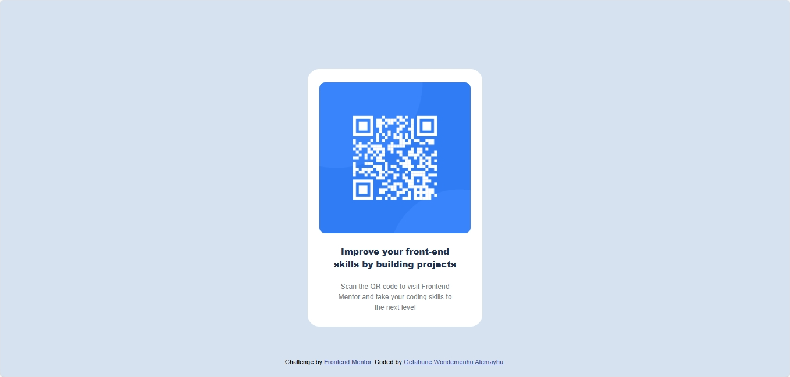

# QR Code Component

A simple and responsive QR code component built with HTML and CSS. This project is a solution to the Frontend Mentor QR code component challenge.

## Table of contents

- [Overview](#overview)
  - [Screenshot](#screenshot)
  - [Links](#links)
- [My process](#my-process)
  - [Built with](#built-with)
  - [What I learned](#what-i-learned)
  - [Continued development](#continued-development)
  - [Useful resources](#useful-resources)
- [Author](#author)
- [Acknowledgments](#acknowledgments)

## Overview

This project is a solution to the Frontend Mentor QR code component challenge.
The goal was to create a QR code component that is visually appealing and responsive. The design is based on the provided design files, and the implementation focuses on using HTML and CSS to achieve the desired layout.
The QR code component is designed to be simple and clean, with a focus on usability and accessibility.

### Screenshot




### Links

- [Live Site](https://yourusername.github.io/qr-code-component-main/)
- [GitHub Repository](https://github.com/yourusername/qr-code-component-main)

## My process

- I started by analyzing the design files provided by Frontend Mentor.
- Next, I created the HTML structure for the QR code component.
- After that, I styled the component using CSS, focusing on responsiveness and accessibility.

## Built with

- Semantic HTML5 markup
- CSS custom properties
- Responsive design
- Clean and modern UI
- Mobile-first workflow
- Accessible QR code display

## What I learned

- How to create a responsive layout using Flexbox.
- The importance of accessibility in web design.
- How to use CSS custom properties for better maintainability.
- How to optimize images for web use.
- Understanding the significance of mobile-first design.
- The importance of semantic HTML in web development.
- How to implement responsive images using the `srcset` attribute.
- Best practices for using alt text in images.

## Continued development

- I plan to enhance the styling of the QR code component for better visual appeal.
- Future updates may include adding animations to the component for a more dynamic user experience.
- I will also explore the possibility of integrating a QR code generation API for dynamic content.

## Useful resources

- [Frontend Mentor](https://www.frontendmentor.io) - A platform for frontend challenges.

- [CSS Tricks - Flexbox](https://css-tricks.com/snippets/css/a-guide-to-flexbox/) - A comprehensive guide to using Flexbox for layout.
- [MDN Web Docs - Responsive Images](https://developer.mozilla.org/en-US/docs/Learn/HTML/Multimedia_and_embedding/Responsive_images) - A guide to using responsive images in web development.
- [W3Schools - CSS Flexbox](https://www.w3schools.com/css/css3_flexbox.asp) - A tutorial on CSS Flexbox layout.
- [CSS Tricks - Grid](https://css-tricks.com/snippets/css/complete-guide-grid/) - A complete guide to CSS Grid layout.

## Author

- Your Name
- [Your Website](https://yourwebsite.com)
- [Your LinkedIn](https://www.linkedin.com/in/yourprofile/)
- [Your Twitter](https://twitter.com/yourprofile)
- [Your GitHub](https://github.com/yourusername)

## Acknowledgments

- A special thanks to the Frontend Mentor community for their support and feedback.
- Thanks to the designers and developers who contributed to the design files and provided inspiration for this project.
- Acknowledgment to the resources and tutorials that helped me learn and implement the features in this project.

## Installation

1. Clone the repository:

```bash
git clone https://github.com/yourusername/qr-code-component-main.git
```

2. Open `index.html` in your browser to view the project.

## Technologies Used

- HTML5
- CSS3
- Flexbox

## Project Structure

```
qr-code-component-main/
├── index.html
├── styles.css
├── images/
└── README.md
```

## Credits

Challenge by [Frontend Mentor](https://www.frontendmentor.io)
